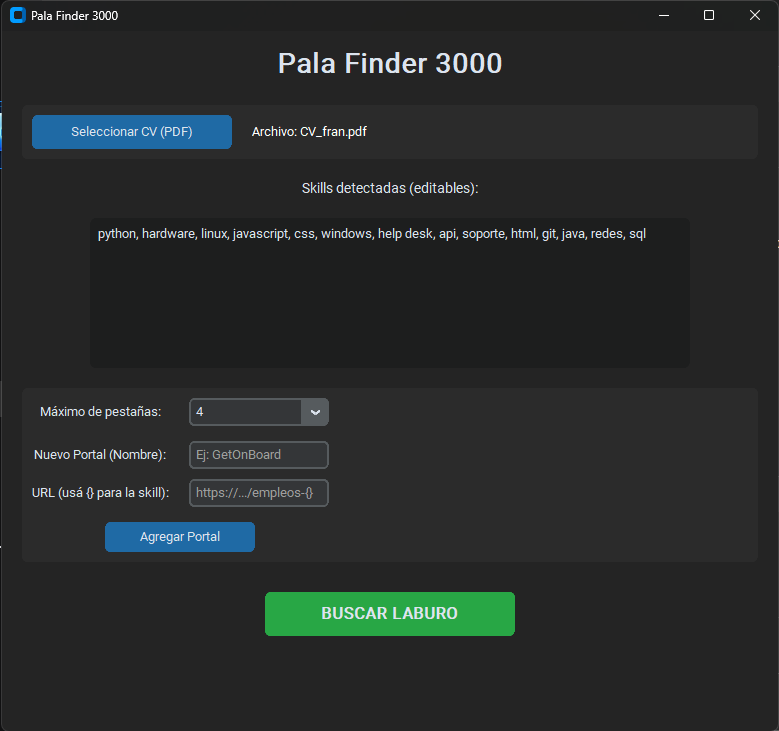

# Pala Finder 3000



Herramienta open source para automatizar la búsqueda de empleo sin caer en el spam de los bots. Analiza tu CV localmente, extrae tus skills y te abre búsquedas filtradas en los principales portales de empleo.

## Filosofía del Proyecto
- **100% Local y Privado:** Tu CV nunca abandona tu máquina.
- **Modo RAM Baja:** Pensado para PCs modestas. Limitá la apertura de pestañas para no fundir el navegador.
- **Humano en el loop:** No aplica solo. La herramienta prepara el terreno y filtra la basura, vos decidís dónde postularte.

## Features
- **Auto-detección de Skills:** Lee el PDF y extrae palabras clave técnicas y blandas.
- **Blacklist Inteligente:** Filtra automáticamente ofertas que pidan "Senior", "Lead" o "5 años de experiencia".
- **Portales Personalizables:** Agregá cualquier portal de empleo usando `{}` como comodín en la URL.
- **UI Moderna:** Interfaz oscura y liviana construida con CustomTkinter.

## Instalación

1. Cloná el repositorio:
   ```bash
   git clone https://github.com/merelesfran/pala_finder_3000.git
   cd pala_finder_3000